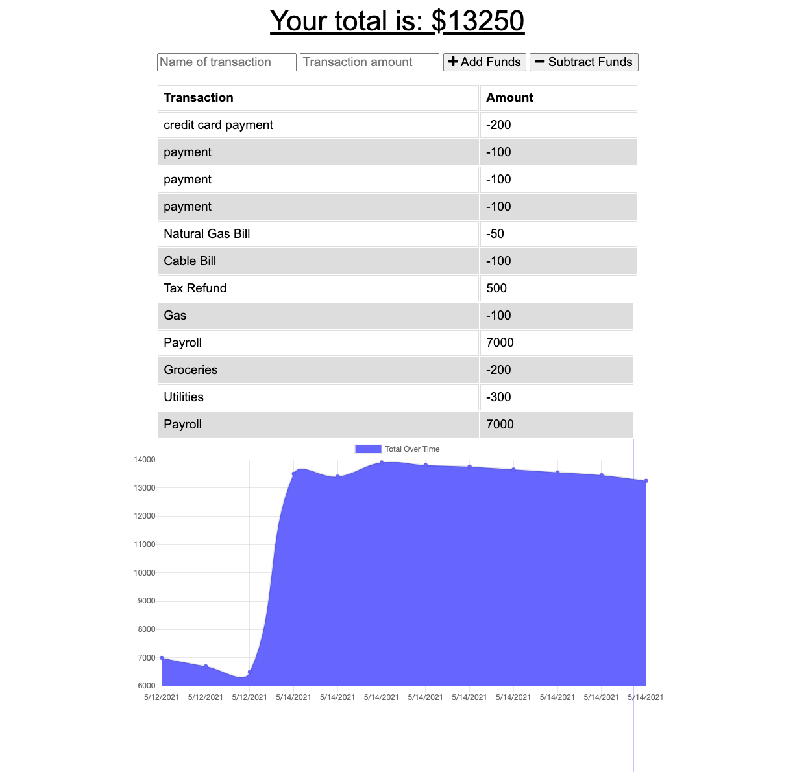

# budget-anywhere


## Description

budget-anywhere is an application that allows the user to track income and expenses, even without an internet connection.  

---

## Deployed Application

https://secure-crag-36323.herokuapp.com/

---

## GitHub Repository

https://github.com/swillrich5/budget-anywhere

---

## Table of Contents

* [Installation](#installation)

* [Usage](#usage)

* [Technology](#technology)

* [Application Images](#Application-Images)

* [License](#license)

* [Contributing](#Contributing)

* [Questions](#Questions)

---

## Installation

If you wish to run your own copy of the application, install the required node modules by running:

```
npm i
```

In addition, MongoDB is required.  Please see the Technology section below for a link to MongoDB.

---

## Usage

After installing the required npm modules and creating the database, the application can be started and run locally by entering:

```
npm start
```
from the command line.  

---

## Technology

The following technology was used to build note-taker:

  * express - https://www.npmjs.com/package/express

  * mongodb - https://www.mongodb.com/

  * mongoose - https://mongoosejs.com/

  * morgan - https://www.npmjs.com/package/morgan

  * node - https://nodejs.org/en/

---

## Application-Image

budget-anywhere


---


## License

None

---

## Contributing

Please report any issues using my contact information below.

---

## Questions

GitHub Profile: https://github.com/swillrich5

Email Address: swillrich@gmail.com